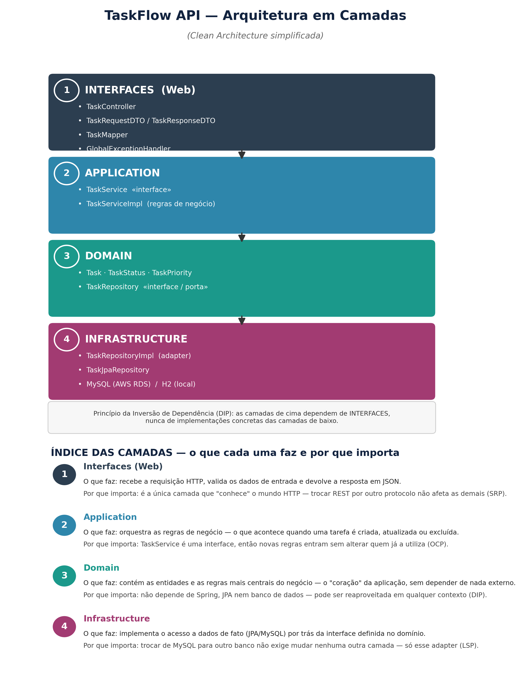
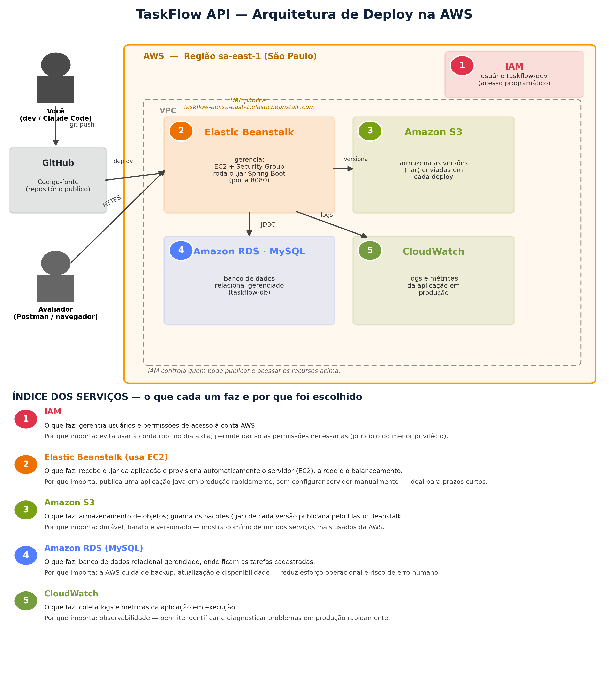
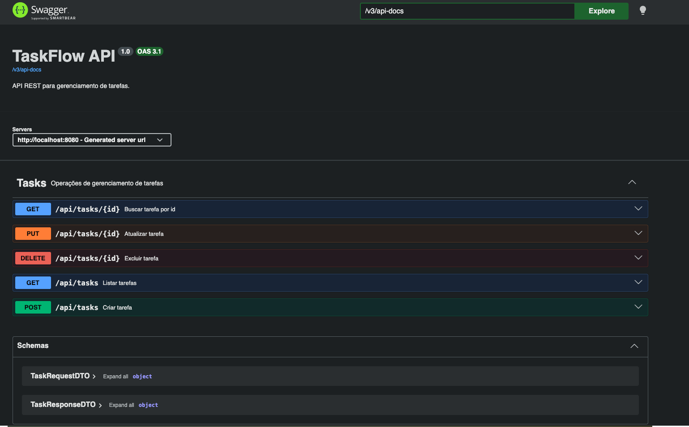
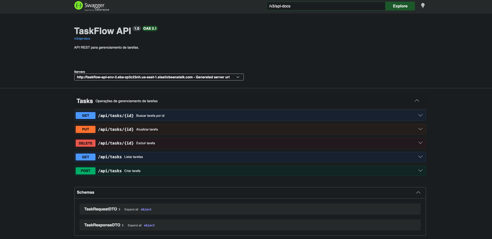
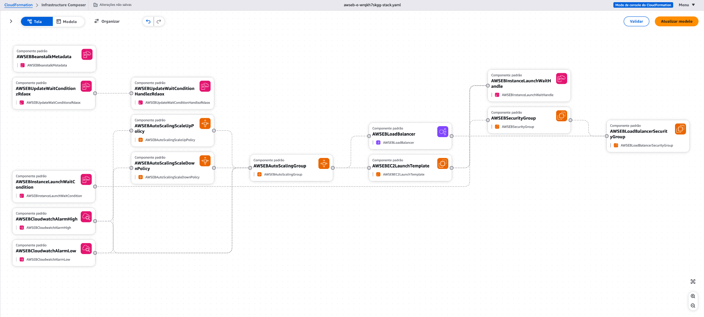
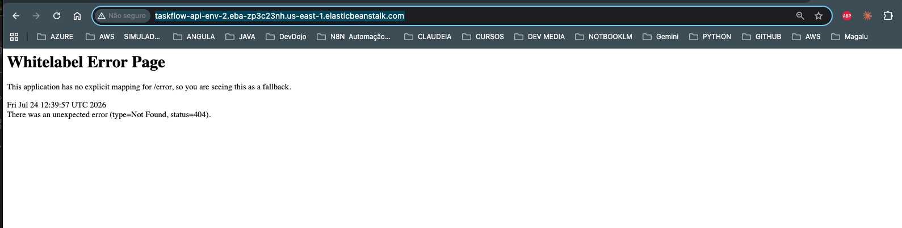
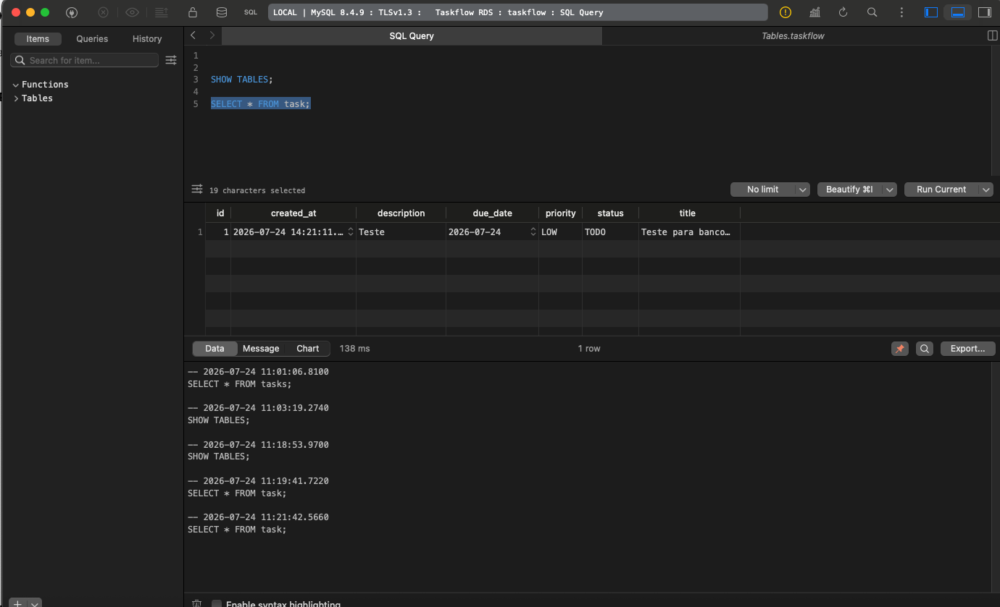

# TaskFlow API

Projeto criado em 23 de julho de 2026

API REST para gerenciamento de tarefas, construida em Spring Boot,
aplicando principios SOLID e arquitetura em camadas, com deploy na AWS.

Sobre o nome da API: "TaskFlow" é a junção de Task (tarefa) + Flow (fluxo) — o nome sugere justamente o que a API faz: gerenciar o fluxo de uma tarefa, do momento em que ela é criada (TODO) até passar por andamento (IN_PROGRESS) e ser concluída (DONE).
É um nome comum no mundo de ferramentas de produtividade (dá aquele ar de Trello/Jira), curto, fácil de lembrar e de pronunciar em uma entrevista — e ainda comunica bem o propósito do projeto só pelo nome, o que é um detalhe que costuma chamar atenção positiva do recrutador.


## Arquitetura da aplicacao



## Onde os principios SOLID foram aplicados

> **Nota: o que são os princípios SOLID?**  
> SOLID é um conjunto de 5 princípios de design orientado a objetos, criados para tornar o código mais fácil de entender, manter e evoluir sem quebrar o que já funciona. Aplicá-los reduz o acoplamento entre as partes do sistema — ou seja, mudanças em uma camada (como trocar o banco de dados) não exigem alterar as demais, tornando o projeto mais flexível a mudanças futuras.

| Principio | Onde foi aplicado |
|-----------|--------------------|
| SRP (Single Responsibility Principle) | `TaskController`, `TaskServiceImpl` e `TaskRepositoryImpl`, cada um com uma unica responsabilidade (camada web, regra de negocio e persistencia, respectivamente) |
| OCP (Open/Closed Principle) | Interface `TaskService`, que permite novas implementacoes sem alterar quem depende dela |
| LSP (Liskov Substitution Principle) | `TaskRepositoryImpl` implementando `TaskRepository`, podendo substituir a abstracao sem quebrar o comportamento esperado |
| ISP (Interface Segregation Principle) | Interfaces `TaskRepository` e `TaskService` separadas, cada uma com metodos coesos ao seu proposito |
| DIP (Dependency Inversion Principle) | `TaskController` dependendo da abstracao `TaskService`, e nao de uma implementacao concreta |


## Arquitetura AWS



IAM -> Elastic Beanstalk (EC2) -> RDS (MySQL) | CloudWatch | S3

## Tecnologias

- Java A
- Spring Boot 4.0.7
- Spring Data JPA
- MySQL
- H2
- Docker
- springdoc-openapi (Swagger)
- JUnit 5 + Mockito
- AWS (IAM, EB, RDS, CloudWatch, S3)

## Como rodar localmente

```bash
./mvnw spring-boot:run -Dspring-boot.run.profiles=local
```

Acesse: http://localhost:8080/swagger-ui.html

## Endpoints

| Metodo | Endpoint |
|--------|----------|
| POST   | /api/tasks |
| GET    | /api/tasks |
| GET    | /api/tasks/{id} |
| PUT    | /api/tasks/{id} |
| DELETE | /api/tasks/{id} |

## Testando no Postman

Importe o arquivo `postman_collection.json` ou importe direto via
Swagger: Import > Link > `<url>/v3/api-docs`


## Recursos AWS utilizados

1. **IAM (Identity and Access Management)** — gerencia usuários e permissões de acesso aos serviços da AWS
2. **Elastic Beanstalk** — orquestra o deploy da aplicação, provisionando EC2, Load Balancer e Auto Scaling automaticamente
3. **EC2 (Elastic Compute Cloud)** — instância virtual onde a aplicação Spring Boot roda de fato
4. **Application Load Balancer** — distribui as requisições recebidas entre as instâncias da aplicação
5. **Auto Scaling Group** — ajusta automaticamente o número de instâncias conforme a demanda
6. **Security Groups** — funcionam como firewall, controlando quem pode acessar cada recurso
7. **RDS (Relational Database Service) - MySQL** — banco de dados relacional gerenciado, onde os dados das tarefas são persistidos
8. **S3 (Simple Storage Service)** — armazena as versões do `.jar` da aplicação enviadas a cada deploy
9. **CloudWatch** — coleta logs e métricas da aplicação em produção
10. **CloudFormation** — gera e gerencia toda a infraestrutura acima de forma declarativa, por trás do Elastic Beanstalk

## Evidencias

### Swagger UI local

URL: http://localhost:8080/swagger-ui/index.html#/Tasks/getTaskById



### Swagger UI em produção AWS

Interface interativa da API rodando no ambiente de produção AWS, expondo todos os endpoints do CRUD de tarefas:

URL: http://taskflow-api-env-2.eba-zp3c23nh.us-east-1.elasticbeanstalk.com/swagger-ui/index.html



### Infraestrutura real provisionada na AWS

### Infraestrutura real provisionada na AWS

Um dos aprendizados deste projeto foi entender o papel do **AWS CloudFormation** por trás do Elastic Beanstalk: embora o deploy pareça simples do ponto de vista do desenvolvedor (upload do .jar, alguns cliques), o Elastic Beanstalk na verdade gera e executa um template CloudFormation completo, provisionando e orquestrando cada recurso da infraestrutura — Auto Scaling Group, Application Load Balancer, Security Groups, EC2 Launch Template — de forma declarativa e versionada.

O diagrama abaixo foi gerado automaticamente pelo AWS Infrastructure Composer a partir desse template. Diferente do diagrama de arquitetura apresentado anteriormente (que é conceitual, pensado por mim), este é extraído diretamente dos recursos que a AWS efetivamente provisionou — uma confirmação real, e não apenas teórica, de que a infraestrutura existe e está configurada como esperado:

Esse contato com o CloudFormation reforçou um princípio central de Infrastructure as Code (IaC): infraestrutura provisionada por ferramentas gerenciadas (como o Elastic Beanstalk) não é uma "caixa preta" — pode e deve ser inspecionada, versionada e compreendida, assim como o próprio código da aplicação.





### Comportamento esperado na raiz da aplicação


A TaskFlow API é uma **API REST pura, sem interface visual (frontend)** — ou seja, ela não possui páginas HTML, telas ou uma "home page" para ser exibida no navegador. Toda a interação com a aplicação acontece através de chamadas HTTP diretas aos endpoints (`/api/tasks`) ou pela documentação interativa do Swagger.

Por esse motivo, ao acessar a raiz do domínio (`/`) diretamente no navegador, o Spring Boot retorna uma página de erro 404 padrão — não existe nenhum controller mapeado para esse caminho, já que os endpoints reais ficam sob `/api/tasks`. Esse comportamento é esperado e confirma que a aplicação está no ar e respondendo corretamente, apenas sem uma rota configurada para `/`:

Essa separação também reflete uma decisão consciente de arquitetura: a API foi desenhada seguindo o Single Responsibility Principle (SRP), concentrando-se exclusivamente na camada de negócio e persistência dos dados de tarefas. Não é responsabilidade do backend renderizar interfaces — essa seria a responsabilidade de um frontend separado (ex: React, Angular ou uma SPA consumindo esses mesmos endpoints), que poderia ser adicionado futuramente sem exigir qualquer alteração na API.

URL: http://taskflow-api-env-2.eba-zp3c23nh.us-east-1.elasticbeanstalk.com/



Os endpoints funcionais podem ser conferidos via Swagger UI (seção acima) ou diretamente em `/api/tasks`.


### Teste de persistência: API → RDS em produção

Para validar a integração completa entre a aplicação e o banco de dados em produção, foi criada uma tarefa de teste diretamente pelo Swagger UI (ambiente AWS), e em seguida consultado o banco de dados via **DataGrip** (ferramenta de administração de banco de dados da JetBrains), conectado diretamente à instância **Amazon RDS MySQL** (`taskflow-db`), banco `taskflow`.

A query `SELECT * FROM task;` confirma que o registro criado pela API foi persistido corretamente no RDS, validando a conexão de ponta a ponta entre a aplicação Spring Boot (rodando no Elastic Beanstalk) e o banco de dados gerenciado na AWS:




## Deploy na AWS

O deploy foi feito via **AWS Elastic Beanstalk**, plataforma gerenciada que orquestra a infraestrutura necessária para rodar a aplicação Spring Boot (EC2, Load Balancer, Auto Scaling, Security Groups) automaticamente.

### Passos realizados

1. **Configuração inicial da AWS CLI** — instalação via Homebrew e configuração com credenciais do usuário IAM `taskflow-dev`, criado especificamente para este projeto (`AdministratorAccess`, ver seção de trade-offs abaixo)

2. **Provisionamento do banco de dados** — criação de uma instância RDS MySQL (`taskflow-db`, engine 8.4.9, classe `db.t4g.micro`, dentro do Free Tier), na região `us-east-1`

3. **Build da aplicação** — geração do artefato `.jar` executável via Maven:
```bash
   ./mvnw clean package -DskipTests
```

4. **Criação do ambiente Elastic Beanstalk** — aplicação `taskflow-api`, plataforma Corretto 17 (64bit Amazon Linux 2023), com variáveis de ambiente configuradas para conexão com o RDS (`SPRING_DATASOURCE_URL`, `SPRING_DATASOURCE_USERNAME`, `SPRING_DATASOURCE_PASSWORD`, `SPRING_PROFILES_ACTIVE=prod`)

5. **Upload e deploy do artefato** via console ou CLI (`create-application-version` + `update-environment`)


### Troubleshooting em produção

O primeiro deploy resultou em erro `502 Bad Gateway`. A investigação via logs (`eb-engine.log`, `web.stdout.log`) revelou dois problemas distintos, resolvidos em sequência:

- **Conexão recusada com o RDS**: o Security Group do banco (`taskflow-db-sg`) só autorizava acesso a partir do meu IP local — faltava uma regra de entrada liberando o Security Group da instância EC2 do Elastic Beanstalk na porta 3306. Corrigido com:
```bash
  aws ec2 authorize-security-group-ingress --group-name taskflow-db-sg --protocol tcp --port 3306 --source-group <sg-da-instancia> --region us-east-1
```

- **502 mesmo com a aplicação saudável**: o nginx (proxy reverso do Elastic Beanstalk) esperava a aplicação respondendo na porta `5000` por padrão, enquanto o Spring Boot subia na porta `8080`. Corrigido definindo a variável de ambiente `SERVER_PORT=5000`, lida automaticamente pelo Spring Boot.

Após essas correções, o ambiente ficou com Status `Ready` e Health `Green`, e o endpoint de verificação de saúde confirmou o funcionamento:

```bash
curl http://taskflow-api-env-2.eba-zp3c23nh.us-east-1.elasticbeanstalk.com/actuator/health
# {"groups":["liveness","readiness"],"status":"UP"}
```


### Nota técnica: Spring Boot e a porta do Elastic Beanstalk

<span style="color:red">Exemplo de como o Spring Boot é projetado para se adaptar a diferentes ambientes de execução através de configuração externa</span>

Durante o deploy, foi identificado que o nginx (proxy reverso configurado pelo Elastic Beanstalk na plataforma Amazon Linux 2023) espera, por padrão, que a aplicação responda na porta `5000` — enquanto o Spring Boot, sem configuração explícita, sobe na porta `8080`. Essa divergência causava um erro `502 Bad Gateway` mesmo com a aplicação totalmente saudável e conectada ao banco.

A correção foi feita sem alterar uma linha de código: o Spring Boot lê automaticamente a variável de ambiente `SERVER_PORT` (ou `PORT`, dependendo da versão) para definir a porta do Tomcat embutido. Bastou configurar `SERVER_PORT=5000` nas variáveis de ambiente do Elastic Beanstalk para resolver o conflito — um bom exemplo de como o Spring Boot é projetado para se adaptar a diferentes ambientes de execução através de configuração externa (12-Factor App), em vez de valores fixos no código.


## Consideracoes de seguranca e trade-offs


> **Nota: o que é trade-off?**  
> Trade-off é uma decisão consciente de abrir mão de algo (geralmente segurança, performance ou boas práticas) em troca de outra vantagem mais relevante no momento (geralmente tempo ou simplicidade). As escolhas abaixo não foram feitas por desconhecimento, mas sim ponderando o prazo curto deste projeto de demonstração.

As decisoes abaixo foram tomadas conscientemente devido ao prazo curto deste projeto de demonstracao (poucas horas), e nao por desconhecimento das praticas recomendadas de seguranca na AWS:

- **Uso de `AdministratorAccess`**: o usuario IAM `taskflow-dev` recebeu a policy `AdministratorAccess` para agilizar o desenvolvimento. Em um ambiente de producao real, o correto seria aplicar o principio do menor privilegio, criando uma policy customizada com permissoes restritas apenas aos servicos necessarios (Elastic Beanstalk, RDS, S3, CloudWatch).
- **Access Keys em vez de IAM Roles**: aplicacoes rodando na AWS (como o Elastic Beanstalk) idealmente nao deveriam usar Access Keys fixas para acessar outros servicos. O ideal e usar IAM Roles, que fornecem credenciais temporarias geradas automaticamente pela AWS, eliminando o risco de uma chave permanente ser vazada ou exposta.
- **Access Keys de longo prazo para acesso humano**: as credenciais foram configuradas manualmente via `aws configure`. Para acesso humano em ambientes corporativos, o mais comum hoje e usar AWS IAM Identity Center (SSO) com credenciais temporarias.
- **Autenticacao em pipelines de CI/CD**: caso este projeto evoluisse para um pipeline de CI/CD (ex: GitHub Actions), a pratica atual recomendada seria usar autenticacao federada via OIDC, eliminando a necessidade de armazenar qualquer credencial da AWS como secret.

## Autor

Ariane Moura Barboza
